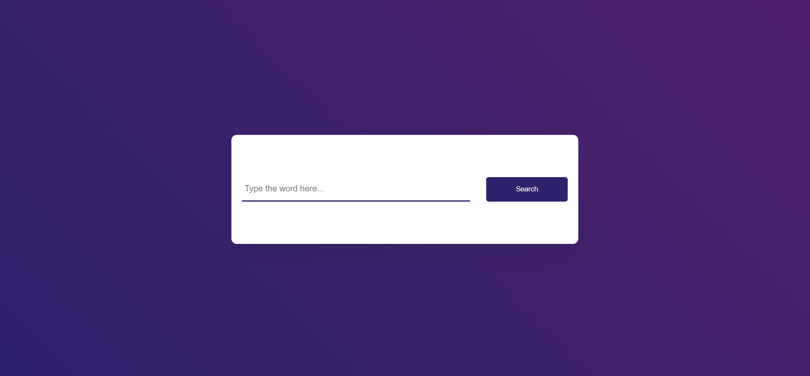

# Dictionary App

A simple dictionary application that allows users to search for English words and get their definitions, parts of speech, phonetic transcriptions, and examples. The app also includes a feature to play the pronunciation of the word if available.

## Features

- Search for English words
- Display word definitions
- Show parts of speech
- Provide phonetic transcriptions
- Display usage examples (if available)
- Play pronunciation audio (if available)

## Technologies Used

- HTML
- CSS
- JavaScript
- [Dictionary API](https://dictionaryapi.dev/)

## Acknowledgments

- Font Awesome for the icons

## Getting Started

### Prerequisites

You need a modern web browser to run this application.

## Screenshots

### Usage

1. Enter a word in the input field.
2. Click the "Search" button.
3. The app will display the word's definition, part of speech, phonetic transcription, and example sentence (if available).
4. Click the speaker icon to hear the pronunciation of the word.

### Troubleshooting

- If the app doesn't find a word, it will display a message saying "Couldn't Find The Word".
- Ensure you have an internet connection as the app fetches data from an online API.
